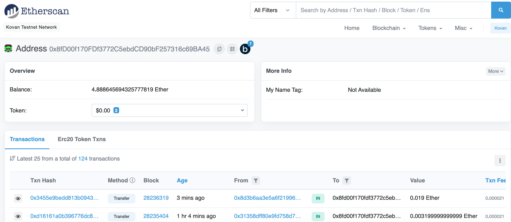

# Challenge_19
## Purpose
To create and validate a transaction on the Kovan ethereum testnet.

# Screenshot of the senders (my) account

# Screenshot of the transaction

# Screenshot of the receiver's account
